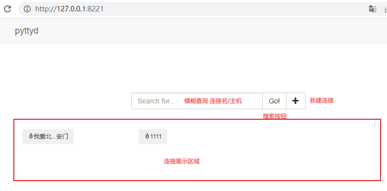

# Pyttyd
一个Python开发的 web ssh 工具，支持保存连接到磁盘

### 安装

```commandline
$ pip install pyttyd
```

### 启动服务

```commandline
$ pyttyd
INFO:     Started server process [1]
INFO:     Waiting for application startup.
INFO:     Application startup complete.
INFO:     Uvicorn running on http://127.0.0.1:8221 (Press CTRL+C to quit)
```

浏览器打开[http://127.0.0.1:8221](http://127.0.0.1:8221)




### pyttyctl

```commandline
$ pyttyctl list
ID               连接名称      主机       端口   用户名   密码      创建时间             更新时间           
d4c19a0bbdc44fb  我爱北天安门  127.0.0.1  2222   root    ****  2023-01-28 06:11:36  2023-02-13 07:03:10
626bab7b8239488  1111         127.0.0.1  2223   root    ****  2023-01-30 03:37:50  2023-02-01 08:25:46
$ pyttyctl conn d4c19a0bbdc44fb
Last login: Tue Feb 01 00:00:00 2023 from 172.29.0.1
root@a7272ab29048:~# pwd
/root
root@a7272ab29048:~# 
```
感谢！！！  
[@bootstrap](https://getbootstrap.com/docs/3.4/)  
[@paramiko](https://github.com/paramiko/paramiko)  
[@FastApi](https://github.com/tiangolo/fastapi)  
[@Jinja2](https://github.com/pallets/jinja)  
[@cryptography](https://github.com/pyca/cryptography)  
[@JSEncrypt](https://github.com/travist/jsencrypt)  
[@crypto-js](https://github.com/brix/crypto-js)

